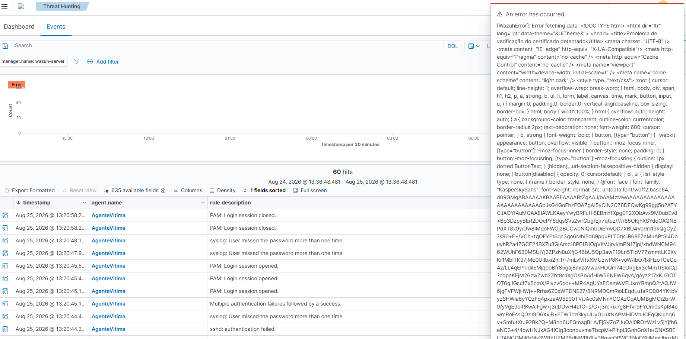
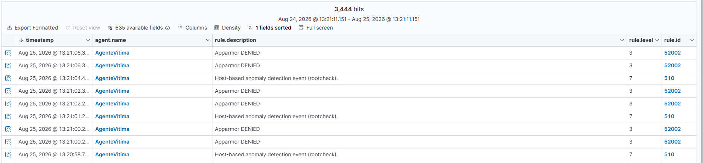

# Caso 002 — Troubleshooting de Ruído Operacional no SIEM

**Data:** 25/08/2026
**Ambiente:** Home Lab pessoal (VirtualBox, NatNetwork)
**Contexto:** Durante a investigação do [Caso 001 (SSH Brute Force)](../HomeLab-SSH-Bruteforce/), dois problemas operacionais surgiram e precisaram ser diagnosticados antes de se conseguir confiar plenamente nos dados do SIEM. Nenhum dos dois é um incidente de segurança, mas ambos são o tipo de ruído que, sem diagnóstico, pode ser confundido com problema de detecção ou até com atividade maliciosa.

## Parte 1 — Erro de certificado no painel do Wazuh

**Sintoma:** popup de erro no painel (`[WazuhError]: Error fetching data`) contendo uma página HTML completa no lugar da resposta esperada, incluindo uma fonte customizada (`KasperskySans`) e o título "Problema de verificação do certificado detectado".



**Diagnóstico:** a fonte `KasperskySans` identifica que a página de erro não veio do Wazuh. Veio do **Kaspersky** (antivírus no Windows host), especificamente do recurso de inspeção de conexões HTTPS criptografadas. O painel do Wazuh usa, por padrão, um **certificado TLS autoassinado** (não emitido por uma autoridade confiável). Quando o Kaspersky intercepta o tráfego HTTPS pra escaneá-lo e encontra esse certificado não confiável, ele bloqueia a requisição e devolve sua própria página de aviso. O front-end do painel não sabia interpretar essa página, pois esperava uma resposta JSON de uma chamada de atualização em segundo plano.

**Resolução:** o acesso voltou ao normal ao abrir o painel numa janela anônima do navegador, o que descartou problema de serviço (Wazuh nunca esteve fora do ar) e apontou para cache/estado da sessão normal do navegador, possivelmente interagindo com a interceptação do Kaspersky.

**Ações possíveis para eliminar de vez (não aplicadas neste momento):** adicionar exceção no Kaspersky para o domínio/porta do painel, ou importar o certificado do Wazuh como confiável no Windows.

## Parte 2 — Volume anormal de eventos "Apparmor DENIED"

**Sintoma:** ao explorar o painel sem filtro, um volume muito alto de eventos (na casa de milhares em poucas horas) com `rule.description: Apparmor DENIED`, surgindo a um ritmo de aproximadamente 1 evento por segundo, poluindo qualquer busca genérica e dificultando encontrar eventos de segurança relevantes.



**Diagnóstico, passo a passo:**

1. No Ubuntu, `sudo journalctl | grep -i apparmor | tail -20` revelou que todas as negações vinham do mesmo perfil: `snap.nextcloud.nextcloud-fixer`, processo `php`, tentando repetidamente as capabilities `setuid` e `setgid` (mudar de usuário/grupo em tempo de execução) e sendo bloqueado pelo confinamento AppArmor do snap.
2. `sudo systemctl status snap.nextcloud.nextcloud-fixer.service` mostrou o serviço `active (running)` havia mais de 4h30, já consumindo mais de 1h20 de CPU, com a mensagem de log: `Nextcloud is not installed - only a limited number of commands are available`.

**Causa raiz:** o snap do Nextcloud (aplicativo de armazenamento de arquivos self-hosted) estava instalado nessa VM, mas a configuração inicial da aplicação nunca havia sido concluída. O serviço de manutenção `nextcloud-fixer`, responsável por corrigir permissões periodicamente, ficava verificando o status da instalação em loop, tentando baixar privilégio a cada tentativa (bloqueado pelo AppArmor) e repetindo o ciclo a cada ~2 segundos, indefinidamente. Um serviço órfão de uma instalação nunca finalizada, sem relação com o propósito do lab.

**Resolução:** como o Nextcloud não fazia parte do escopo do ambiente (Kali / Ubuntu / Wazuh), a aplicação foi removida:

```bash
sudo snap remove nextcloud
```

Isso encerrou o serviço `nextcloud-fixer` e eliminou o ruído na origem.

## Por que isso importa para um analista N1

Nenhum dos dois problemas era um incidente de segurança, mas ambos ilustram uma parte real e constante do trabalho de SOC: **antes de confiar no que o SIEM está mostrando, é preciso entender o que está gerando ruído no ambiente**. Um volume alto e constante de alertas de baixa severidade (como o Apparmor DENIED aqui) não é "mais segurança". É o oposto: esconde o sinal relevante no meio do ruído, exatamente como aconteceu quando tentamos localizar as evidências do brute force em meio a milhares de eventos irrelevantes (Caso 001).

A postura correta não é ignorar o ruído nem tratá-lo como ameaça, e sim isolar a causa raiz (perfil, processo, serviço responsável), decidir se é um problema legítimo a corrigir (nesse caso, uma instalação quebrada gerando desperdício de CPU) e resolver na origem, em vez de compensar com filtros cada vez mais complexos no SIEM.

## Lições aprendidas

- Erros exibidos por um painel web nem sempre vêm da própria aplicação. Inspecionar o conteúdo do erro (nesse caso, uma fonte CSS) pode revelar que a origem é uma ferramenta terceira (antivírus, proxy) interferindo na conexão.
- Certificados autoassinados são normais em labs self-hosted, mas frequentemente geram atrito com ferramentas de segurança do host que fazem inspeção de tráfego.
- Alto volume constante de um único tipo de evento é, por si só, um sinal de investigação, não necessariamente de ataque, mas quase sempre de um processo com comportamento anômalo que vale a pena entender.
- O caminho de diagnóstico no Linux para esse tipo de ruído é replicável: log do kernel (`journalctl -k` ou `dmesg`) para identificar o perfil/processo, depois `systemctl status` do serviço correspondente, depois a decisão de corrigir ou remover.
