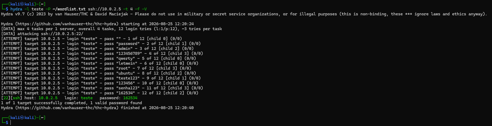
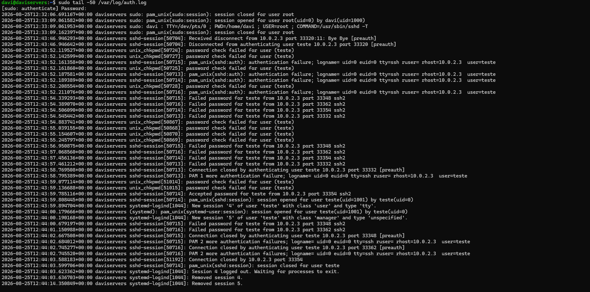
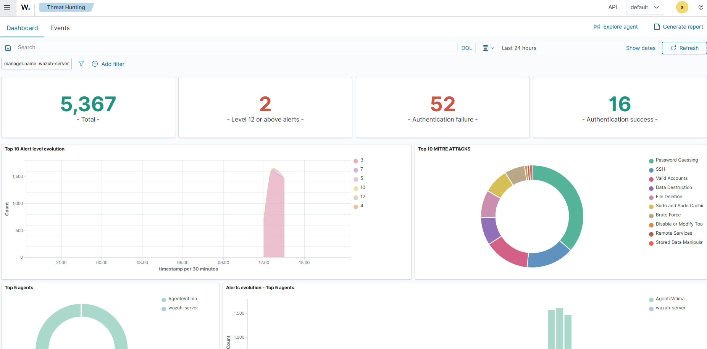
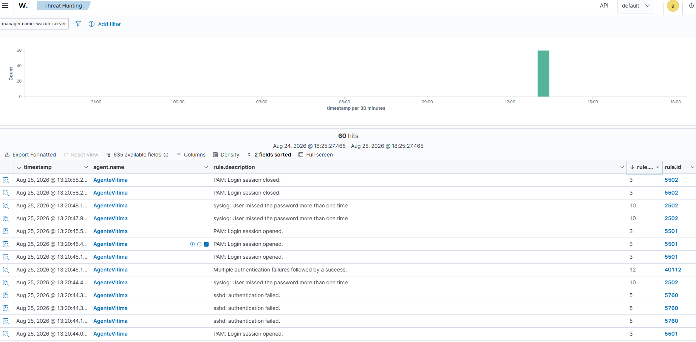
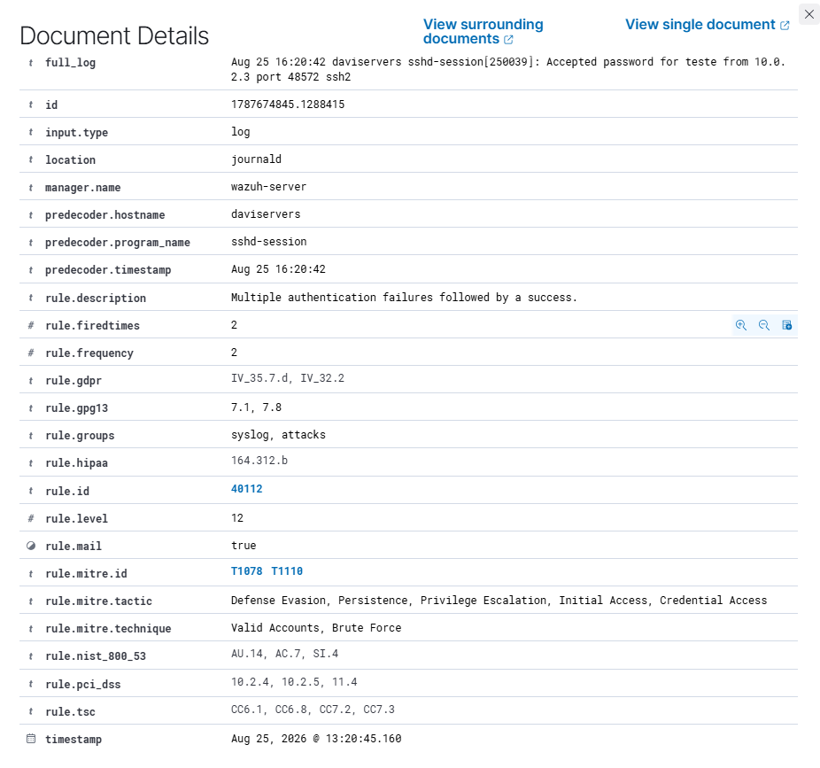

# Caso 001 — Detecção de SSH Brute Force com Sucesso via Wazuh

**Data:** 25/08/2026
**Ambiente:** Home Lab pessoal (VirtualBox, NatNetwork)
**Atacante:** Kali Linux — 10.0.2.3
**Alvo:** Ubuntu Server 24.04 — 10.0.2.5 (agente Wazuh: `AgenteVitima`)
**SIEM:** Wazuh 4.14.7 — 10.0.2.4

## Objetivo do exercício

Simular um ataque de força bruta contra o serviço SSH de um host Linux e validar a capacidade de detecção do SIEM para esse padrão, incluindo a correlação entre múltiplas falhas de autenticação e um login bem-sucedido subsequente.

## Mapeamento MITRE ATT&CK

- **Tática:** Credential Access (TA0006)
- **Técnica:** T1110 (Brute Force)
- **Sub-técnica:** T1110.001 (Password Guessing)

O próprio Wazuh confirmou esse mapeamento automaticamente na regra de correlação disparada (ver evidência abaixo), e foi além: também etiquetou o evento com T1078 (Valid Accounts), cobrindo as táticas de Defense Evasion, Persistence, Privilege Escalation e Initial Access. Faz sentido: o momento em que uma senha é quebrada com sucesso é exatamente a fronteira entre "tentando obter acesso" (T1110) e "já possui uma credencial válida utilizável" (T1078), e o Wazuh reflete essa transição no próprio alerta.

## Preparação do cenário

Para viabilizar um teste controlado (positive control), foi criado um usuário de teste dedicado no Ubuntu, em vez de atacar uma conta de produção:

```bash
sudo useradd -m teste
sudo passwd teste
```

Confirmação prévia de que o SSH aceita autenticação por senha (pré-requisito para o ataque funcionar):

```bash
sudo sshd -T | grep passwordauthentication
# passwordauthentication yes
```

## Execução do ataque

Wordlist customizada, criada no Kali, com a senha correta posicionada deliberadamente para gerar um número conhecido de tentativas falhas antes do sucesso.

Ataque com Hydra, direcionado ao IP interno do alvo na rede NAT (não via o redirecionamento de porta do host, que só existe para acesso externo à VM):

```bash
hydra -l teste -P ~/wordlist.txt ssh://10.0.2.5 -t 4 -f -V
```

**Resultado:** 11 tentativas falhas seguidas de 1 sucesso (`teste` / `162534`), em ~16 segundos, todas originadas de 10.0.2.3.



## Evidência no host alvo (ground truth)

Confirmação direta no Ubuntu de que todas as tentativas, falhas e o sucesso final, foram registradas pelo sistema operacional:



## Troubleshooting: log existia, mas não chegava ao Wazuh

Na primeira execução do ataque, o Wazuh não gerou nenhum alerta relevante. Diagnóstico resumido:

1. Confirmado que o agente estava com status **Active**.
2. Confirmado, direto no Ubuntu, que o `/var/log/auth.log` continha todas as 11 falhas e o sucesso. Isso descartou problema de geração de log.
3. Buscas no painel não retornaram os eventos esperados.
4. **Causa raiz identificada:** o agente Wazuh no Ubuntu estava configurado para coletar logs via `journald`, sem nenhuma entrada `<localfile>` monitorando `/var/log/auth.log` diretamente.
5. **Correção aplicada:** adicionada uma entrada `<localfile>` explícita monitorando `/var/log/auth.log` em formato `syslog`, seguida de `sudo systemctl restart wazuh-agent`.
6. Ataque reexecutado após a correção. Desta vez os eventos foram corretamente capturados e correlacionados (documentado neste caso).

*(O caso completo desse troubleshooting, incluindo os prints do erro de certificado e do loop de eventos, está documentado separadamente em [Caso 002 — Troubleshooting de Ruído Operacional no SIEM](../HomeLab-SIEM-Troubleshooting/).)*

## Evidência de detecção

Visão geral do painel após o ataque: 5.367 eventos totais na janela analisada, dos quais 2 alcançaram nível 12 ou superior, 52 foram falhas de autenticação e 16 sucessos. O gráfico de MITRE ATT&CK já destaca Password Guessing, SSH, Valid Accounts e Brute Force como as técnicas mais recorrentes no período.



Isolando os eventos relacionados ao ataque (60 hits), o alerta de maior severidade aparece destacado: `Multiple authentication failures followed by a success`, nível **12**, rule.id **40112**. Essa é a regra de correlação que buscávamos.



Detalhe completo do documento desse alerta:

| Campo | Valor |
|---|---|
| rule.id | 40112 |
| rule.description | Multiple authentication failures followed by a success |
| rule.level | 12 |
| rule.mitre.id | T1078, T1110 |
| rule.mitre.tactic | Defense Evasion, Persistence, Privilege Escalation, Initial Access, Credential Access |
| rule.mitre.technique | Valid Accounts, Brute Force |
| timestamp | Aug 25, 2026 @ 13:20:45.160 |
| predecoder.program_name | sshd-session |



**Observação técnica:** o campo `location` desse documento aparece como `journald`, não como o `auth.log` que adicionamos na correção. É possível que, após o restart do agente, a coleta via journald também tenha passado a capturar corretamente esse tipo de evento (talvez por reprocessar a partir de um cursor mais recente), operando em paralelo à nova fonte de arquivo. Vale investigar num próximo caso se as duas fontes estão duplicando eventos. Isso não invalida a detecção, mas é um ponto de atenção para configuração de produção.

## Análise como N1

**Falso positivo?** Não. Mesmo IP de origem realizando múltiplas tentativas de senha contra o mesmo usuário, culminando em sucesso, em janela curta de tempo. É um padrão comportamental consistente de brute force bem-sucedido, não ruído aleatório.

**Gravidade:** Alta. O nível 12 atribuído pelo Wazuh já indica criticidade, mas o contexto agrava ainda mais a leitura: a origem é **interna** à rede, não um scanner externo da internet. Tráfego malicioso originado de dentro da rede é tipicamente mais preocupante, pois sugere que a máquina de origem pode já estar comprometida e sendo usada para movimentação lateral, em vez de ser apenas ruído de varredura externa.

**Próximos passos de um N1 real, antes de escalar:**
- Verificar se a conta atacada deveria de fato existir com acesso SSH por senha (neste caso, não deveria: é uma exposição desnecessária).
- Checar se o IP de origem tentou o mesmo padrão contra outros hosts da rede.
- Investigar atividade pós-login (comandos executados, arquivos acessados) para determinar se houve ação além da simples autenticação.
- Documentar linha do tempo completa e escalar para N2 com recomendação de contenção.

## Recomendações de remediação / hardening

- Remover a conta de teste (`teste`) após o exercício, ou desabilitar login por senha para ela.
- Considerar desabilitar autenticação por senha via SSH em favor de autenticação por chave (`PasswordAuthentication no`), mantendo senha apenas onde estritamente necessário.
- Implementar bloqueio por tentativas (`faillock`/`pam_tally2`) ou uma ferramenta como `fail2ban` para conter automaticamente IPs com esse padrão de comportamento.
- Garantir que a coleta de logs do Wazuh não dependa exclusivamente do `journald` para fontes críticas como autenticação SSH. Manter `/var/log/auth.log` como fonte explícita e testada.

## Lições aprendidas

- Confirmar que a fonte de dados configurada no SIEM é de fato a que se espera (journald vs. arquivo de log tradicional) antes de assumir que "não há ataque" quando não há alerta.
- Validar a ground truth (log bruto no host) antes de suspeitar do SIEM. Nesse caso, o log estava correto, o gap era só na coleta.
- Um alerta de correlação (ex: "múltiplas falhas seguidas de sucesso") é mais valioso para triagem do que eventos individuais de falha, pois reduz ruído e já aponta o padrão crítico diretamente.
- O próprio SIEM pode enriquecer o alerta com múltiplos frameworks (MITRE ATT&CK, NIST 800-53, PCI DSS, HIPAA, GDPR). Vale a pena explorar esses campos ao documentar um caso, pois eles já vêm prontos para justificar a gravidade em termos que um time de compliance também entende.