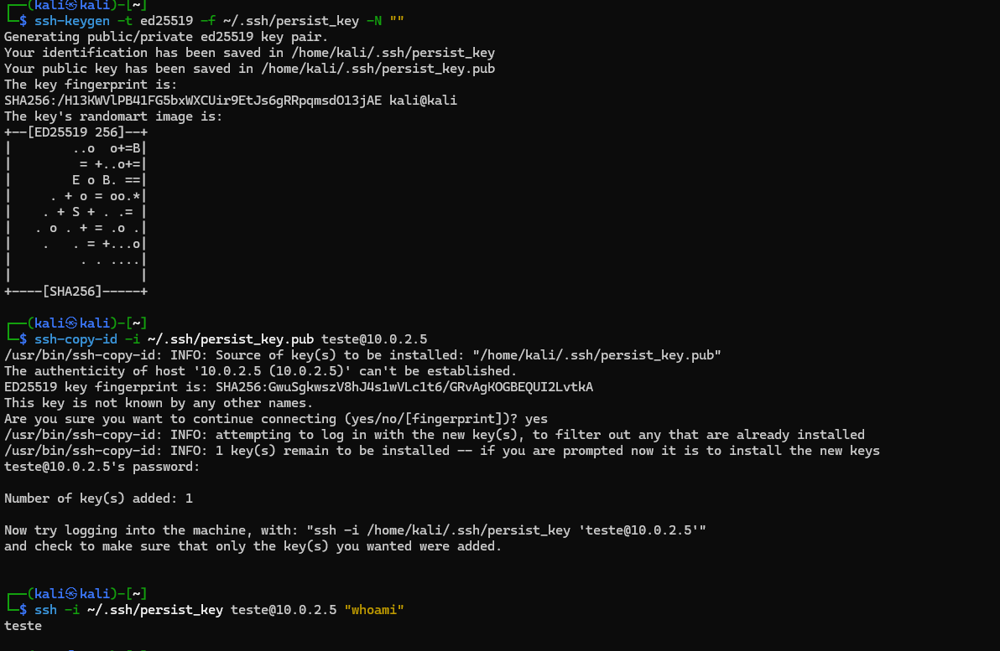
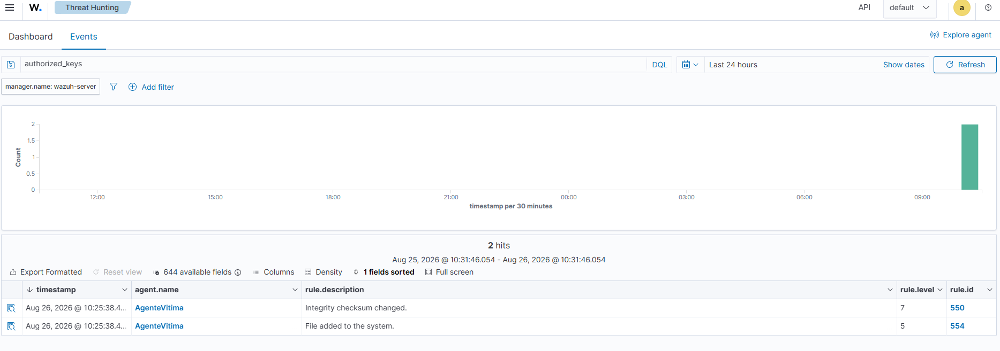
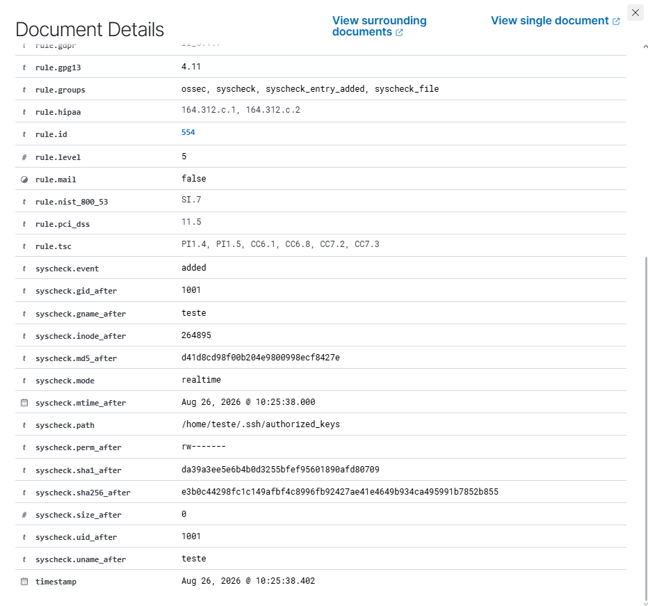
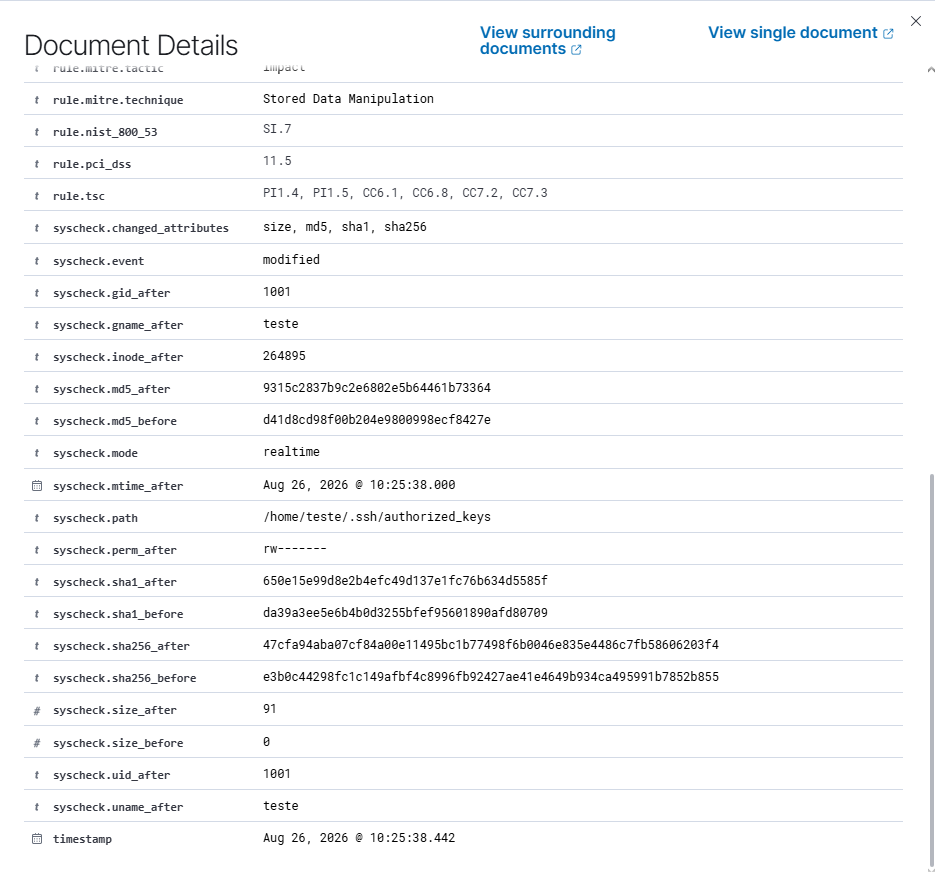

# Caso 003 — Persistência via SSH Authorized Keys (pós-exploração)

**Data:** 26/08/2026
**Ambiente:** Home Lab pessoal (VirtualBox, NatNetwork)
**Atacante:** Kali Linux — 10.0.2.3
**Alvo:** Ubuntu Server 24.04 — 10.0.2.5 (agente Wazuh: `AgenteVitima`)
**SIEM:** Wazuh 4.14.7 — 10.0.2.4

## Objetivo do exercício

Simular a fase de pós-exploração de um atacante que já possui uma credencial válida (obtida no [Caso 001](../HomeLab-SSH-Bruteforce/)) e usa essa credencial para estabelecer persistência via chave SSH, validando a capacidade de detecção do módulo de File Integrity Monitoring (FIM) do Wazuh sobre arquivos críticos de autenticação.

## Narrativa

O atacante já possui a credencial do usuário `teste`, obtida por força bruta no Caso 001. Ele faz login real via SSH com essa conta e, uma vez dentro, executa passos típicos de pós-exploração:

1. Reconhecimento de escalação de privilégio — verificar permissão de `sudo`, procurar binários com bit SUID abusáveis.
2. Persistência — adicionar uma chave SSH própria no `authorized_keys` da conta comprometida. Isso garante acesso ao host mesmo que a senha original seja trocada depois.

## Mapeamento MITRE ATT&CK

- **Discovery (TA0007)** — reconhecimento de privilégio (sudo, SUID).
- **Persistence (TA0003)** — **T1098.004 (Account Manipulation: SSH Authorized Keys)**.

**Observação técnica:** o Wazuh marcou automaticamente os eventos de FIM deste caso como `rule.mitre.tactic: Impact` / `rule.mitre.technique: Stored Data Manipulation` (ver evidência abaixo). Essa é a tag genérica que o Wazuh aplica a *qualquer* alteração em arquivo monitorado pelo `syscheck` — a regra não tem contexto sobre o significado semântico do arquivo que mudou. A leitura correta (Persistence/T1098.004) exige o analista aplicar o contexto: sabemos que é o `authorized_keys` de uma conta já comprometida por brute force no Caso 001. Não confiar cegamente na tag MITRE automática do SIEM é uma lição real de triagem N1.

## Preparação: confirmar cobertura do FIM antes de atacar

Lição aplicada do Caso 002 (a fonte de log esperada não estava de fato sendo monitorada): desta vez o processo foi invertido, confirmando a cobertura do `syscheck` **antes** do ataque, para garantir que a detecção tivesse chance real de funcionar.

```bash
sudo cat /var/ossec/etc/ossec.conf | grep -A 20 "<syscheck>"
```

Objetivo: confirmar que `/etc` (onde ficam `cron.d` e `sudoers`) e as pastas de usuário (onde fica `.ssh/authorized_keys`) estavam no escopo monitorado.

## Execução do ataque

Geração de uma chave dedicada para esta operação e instalação na conta comprometida:

```bash
ssh-keygen -t ed25519 -f ~/.ssh/persist_key -N ""
ssh-copy-id -i ~/.ssh/persist_key.pub teste@10.0.2.5
ssh -i ~/.ssh/persist_key teste@10.0.2.5 "whoami"
```

**Resultado:** o `ssh-copy-id` instalou a chave (`Number of key(s) added: 1`) após uma única solicitação de senha. O login final com a chave dedicada retornou `teste` **sem pedir senha** — persistência confirmada, sobrevivendo a uma eventual troca da senha original. Como o usuário `teste` não tinha chave SSH configurada antes, o `ssh-copy-id` teve que criar tanto a pasta `.ssh` quanto o arquivo `authorized_keys` do zero.



## Caça no Wazuh

Local: **Threat Hunting → Events**, filtro `manager.name: wazuh-server`, intervalo "Last 24 hours", busca por `authorized_keys`.

**Resultado:** 2 hits.

| # | rule.description | rule.id | rule.level | syscheck.event | syscheck.path | timestamp |
|---|---|---|---|---|---|---|
| 1 | File added to the system | 554 | 5 | added | /home/teste/.ssh/authorized_keys | Aug 26, 2026 @ 10:25:38.402 |
| 2 | Integrity checksum changed | 550 | 7 | modified | /home/teste/.ssh/authorized_keys | Aug 26, 2026 @ 10:25:38.442 |



### Evento `added` (rule.id 554, nível 5)

- `syscheck.event`: added
- `syscheck.path`: /home/teste/.ssh/authorized_keys
- `syscheck.size_after`: 0
- `syscheck.md5_after`: d41d8cd98f00b204e9800998ecf8427e
- `syscheck.sha1_after`: da39a3ee5e6b4b0d3255bfef95601890afd80709
- `syscheck.sha256_after`: e3b0c44298fc1c149afbf4c8996fb92427ae41e4649b934ca495991b7852b855
- `syscheck.uname_after` / `gname_after`: teste
- `syscheck.perm_after`: rw-------
- `timestamp`: Aug 26, 2026 @ 10:25:38.402

Esses três hashes são exatamente os hashes de um **arquivo vazio** — batem com `size_after: 0`. Confirma que este primeiro evento é a criação do arquivo, ainda sem conteúdo.



### Evento `modified` (rule.id 550, nível 7)

- `syscheck.event`: modified
- `syscheck.path`: /home/teste/.ssh/authorized_keys
- `syscheck.changed_attributes`: size, md5, sha1, sha256
- `syscheck.size_before`: 0 → `syscheck.size_after`: 91
- `syscheck.md5_before`: d41d8cd98f00b204e9800998ecf8427e → `syscheck.md5_after`: 9315c2837b9c2e6802e5b64461b73364
- `syscheck.sha256_before`: e3b0c44298fc1c149afbf4c8996fb92427ae41e4649b934ca495991b7852b855 → `syscheck.sha256_after`: 47cfa94aba07cf84a00e11495bc1b77498f6b0046e835e4486c7fb58606203f4
- `timestamp`: Aug 26, 2026 @ 10:25:38.442
- Tag automática do Wazuh: `rule.mitre.tactic: Impact`, `rule.mitre.technique: Stored Data Manipulation`

O `size_before`/`md5_before`/`sha256_before` deste evento batem exatamente com os valores `_after` do evento `added` — prova, no nível de hash, de que os dois eventos são a mesma sequência de operações do `ssh-copy-id` (cria arquivo vazio → escreve a chave dentro), 40ms depois.



## Linha do tempo e correlação

- **Caso 001** (força bruta bem-sucedida): 25/08/2026, ~13h20, origem 10.0.2.3, usuário `teste`.
- **Caso 003** (persistência): 26/08/2026, 10:25:38, mesma conta.
- Gap de quase 24h entre comprometimento e persistência — comportamento realista de um atacante cuidadoso, evitando o padrão óbvio de "login logo após brute force" + "mudança de arquivo crítico" acontecendo juntos. É uma correlação que um N1 precisa fazer mesmo com intervalo de tempo grande entre eventos.

## Análise como N1

**Falso positivo?** Não. É a técnica de persistência mais clássica que existe (T1098.004), no arquivo exato que autentica acessos SSH, na mesma conta já sabida comprometida por brute force no dia anterior.

**Gravidade:** Crítica quando o quadro é analisado em conjunto. Isoladamente os alertas do FIM são nível 5 e 7 (moderados, e mal classificados pela tag MITRE automática do Wazuh como "Impact"). Correlacionando com o Caso 001 (mesmo usuário `teste`, mesma origem interna 10.0.2.3), a leitura correta é: acesso inicial (brute force) seguido de persistência (chave SSH) — evidência de um atacante consolidando posição num host comprometido, não um evento de FIM isolado e banal.

**Próximos passos de um N1 real:**
- Escalonamento imediato para N2/CSIRT — a correlação com o Caso 001 já basta, não é mais caso de "investigar antes de decidir".
- Remover a chave SSH adicionada em `/home/teste/.ssh/authorized_keys`.
- Rotacionar a senha do usuário `teste`.
- Investigar se há outras contas ou hosts afetados.
- Revisar todo o histórico de comandos executados naquela sessão SSH.

## Recomendações de remediação / hardening

- Monitorar explicitamente `authorized_keys` em todas as contas com acesso SSH via FIM (`syscheck`), não só nos diretórios padrão do sistema.
- Revisar a tag MITRE automática de regras genéricas de FIM em processos de triagem — usá-la como ponto de partida, não como conclusão.
- Aplicar `PasswordAuthentication no` (chave apenas) reduz a superfície de brute force, mas não impede este tipo de persistência caso a conta já esteja comprometida — reforça a importância do FIM como camada complementar.
- Considerar alertas de correlação dedicados no Wazuh para "login SSH seguido de mudança em authorized_keys da mesma conta", elevando a severidade automaticamente nesse padrão.

## Lições aprendidas

- Confirmar a cobertura real do FIM (`syscheck`) antes de atacar evita repetir o erro do Caso 002, de assumir monitoramento que não existe.
- Um evento de FIM isolado pode parecer rotineiro (nível 5–7); o contexto de um incidente anterior (Caso 001) é o que eleva a gravidade real.
- A tag MITRE automática de uma ferramenta de SIEM reflete a granularidade da regra, não necessariamente a intenção do atacante — o analista precisa aplicar o contexto correto.
- Hashes antes/depois em eventos de FIM permitem reconstruir a sequência exata de operações de uma ferramenta ofensiva (neste caso, as duas etapas internas do `ssh-copy-id`), útil como evidência forense.
