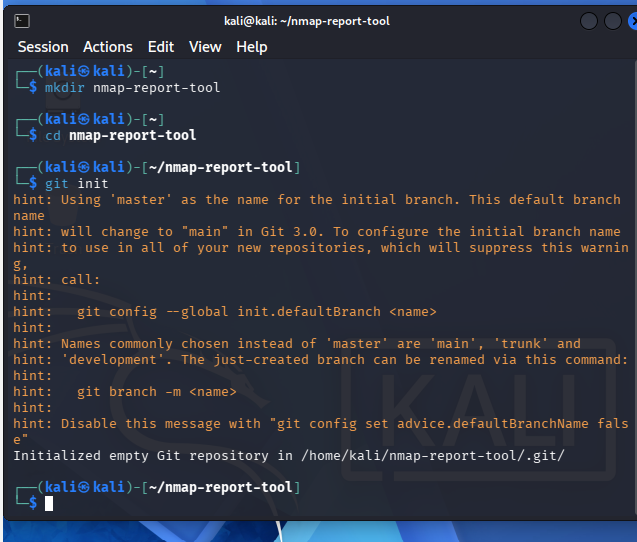
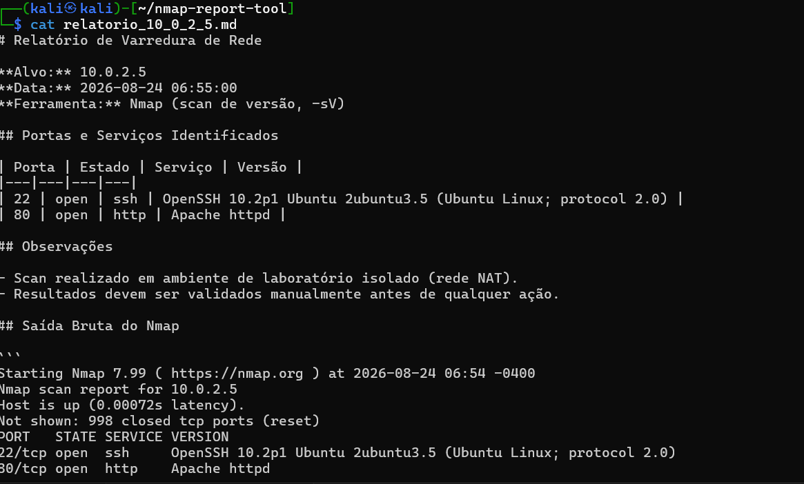
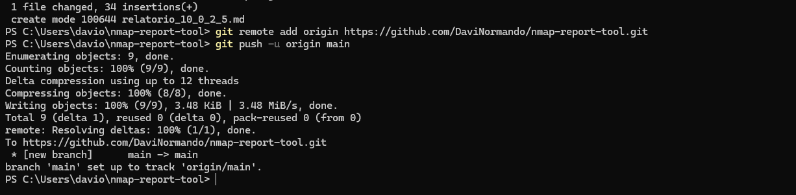

# Automação de Reconhecimento — Nmap Report Tool

**Categoria:** Projeto de Automação / Scripting
**Data:** Agosto 2026
**Stack:** Python 3, Nmap, Git/GitHub, Kali Linux, ambiente home lab próprio

---

## Objetivo

Desenvolver um script em Python que automatiza a etapa de reconhecimento (reconnaissance) em um teste de segurança: executar uma varredura Nmap contra um alvo, extrair as informações relevantes da saída bruta e gerar um relatório estruturado e legível em Markdown — reduzindo o trabalho manual de interpretação que normalmente recai sobre o analista.

Repositório do projeto: [github.com/DaviNormando/nmap-report-tool](https://github.com/DaviNormando/nmap-report-tool)

---

## Ambiente utilizado

Todo o desenvolvimento e teste foi feito dentro do meu home lab pessoal, reaproveitando a infraestrutura já documentada em um writeup anterior:

- **Kali Linux** — máquina de onde o script foi escrito, versionado e executado
- **Ubuntu Server** (10.0.2.5) — máquina alvo utilizada para validar o scan
- Acesso via **SSH** (Kali e Ubuntu), com Port Forwarding configurado no VirtualBox, permitindo operar as VMs a partir do PowerShell do host Windows

---

## Processo de desenvolvimento

### 1. Estruturação do repositório

Criação da pasta do projeto e inicialização do controle de versão diretamente no Kali:

```bash
mkdir nmap-report-tool
cd nmap-report-tool
git init
git branch -m main
```



### 2. Configuração de acesso SSH ao Kali

Para viabilizar copiar/colar de código entre o host Windows e a VM (limitação já conhecida do ambiente, sem interface gráfica), configurei acesso SSH também na máquina Kali, seguindo o mesmo padrão já usado na VM Ubuntu:

```bash
sudo systemctl enable ssh --now
sudo systemctl status ssh
```

Com o Port Forwarding correspondente configurado no VirtualBox (porta `2223` do host → porta `22` do Kali), a conexão passou a ser feita direto do PowerShell:

```powershell
ssh kali@localhost -p 2223
```

### 3. Escrita do script

O script (`nmap_report.py`) foi estruturado em funções isoladas, cada uma com responsabilidade única:

- `run_nmap_scan()` — executa o Nmap via `subprocess` e captura a saída
- `parse_open_ports()` — usa expressão regular para extrair porta, estado, serviço e versão de cada linha relevante da saída
- `generate_markdown_report()` — monta o relatório final em Markdown, incluindo tabela estruturada e a saída bruta anexada como referência

### 4. Validação inicial e ajuste de comportamento do Nmap

Na primeira execução, o Nmap retornou "Host seems down" mesmo com a máquina alvo ligada — o scan padrão depende de uma resposta de ping antes de escanear portas, e esse comportamento nem sempre é confiável em ambientes de laboratório. Ajustei o script para sempre usar a flag `-Pn`, que força o Nmap a escanear diretamente, sem depender da resposta de ping:

```python
["nmap", "-sV", "-T4", "-Pn", target]
```

### 5. Execução validada com sucesso

Com o ajuste aplicado, o script rodou de ponta a ponta contra a máquina Ubuntu do lab:

```bash
sudo python3 nmap_report.py 10.0.2.5
```

Resultado identificado e formatado corretamente:

| Porta | Estado | Serviço | Versão |
|---|---|---|---|
| 22 | open | ssh | OpenSSH 10.2p1 Ubuntu 2ubuntu3.5 (Ubuntu Linux; protocol 2.0) |
| 80 | open | http | Apache httpd |



### 6. Transferência para o host e versionamento final

Para consolidar o versionamento na conta GitHub já configurada no ambiente Windows, os arquivos foram transferidos do Kali para o host via `scp`:

```powershell
scp -P 2223 kali@localhost:~/nmap-report-tool/nmap_report.py .
scp -P 2223 kali@localhost:~/nmap-report-tool/README.md .
scp -P 2223 kali@localhost:~/nmap-report-tool/relatorio_10_0_2_5.md .
```

Repositório inicializado localmente no Windows e commits organizados por etapa lógica (documentação, script, relatório de exemplo), seguidos do envio ao GitHub:

```powershell
git init
git branch -m main
git add README.md
git commit -m "Adiciona documentação do projeto"
git add nmap_report.py
git commit -m "Adiciona script de scan Nmap com parsing de portas"
git add relatorio_10_0_2_5.md
git commit -m "Adiciona relatório de exemplo gerado contra ambiente do home lab"
git remote add origin https://github.com/DaviNormando/nmap-report-tool.git
git push -u origin main
```



---

## Desafios encontrados e soluções

| Desafio | Solução |
|---|---|
| Falta de clipboard funcional na VM Kali (sem interface gráfica) | Configuração de acesso SSH, replicando a solução já usada na VM Ubuntu |
| Erro de sintaxe no `scp` (flag `-p` minúscula em vez de `-P`) | Identificação e correção da flag correta para especificar porta customizada no `scp` |
| Comando `scp` sem destino especificado | Ajuste incluindo `.` (diretório atual) como destino |
| Nmap retornando "Host seems down" com o alvo ligado | Adição da flag `-Pn` ao comando, contornando a dependência de resposta de ping |

---

## Resultado final

- Script funcional, versionado e documentado, publicado em repositório próprio no GitHub
- Validação de ponta a ponta: execução do scan, parsing correto da saída e geração de relatório legível
- Fluxo de trabalho completo demonstrado: desenvolvimento em ambiente Linux isolado, transferência controlada de arquivos e versionamento consolidado no ambiente principal

---

## Aprendizados

- Pequenas diferenças de sintaxe (maiúscula/minúscula em flags de linha de comando) podem gerar erros que parecem mais complexos do que realmente são — vale sempre revisar o comando com calma antes de assumir uma causa mais profunda.
- Automatizar uma tarefa manual e repetitiva (interpretar saída do Nmap) mesmo em escala pequena já demonstra o tipo de raciocínio esperado em funções de segurança ofensiva: identificar fricção no processo e resolver com código.
- Documentar não só o resultado, mas o processo de debugging, tem valor prático — a solução de cada erro encontrado aqui é reaproveitável em qualquer projeto futuro que envolva SSH, SCP ou Nmap.

---

## Próximos passos

- Expandir o parser para suportar múltiplos alvos em uma única execução
- Adicionar opção de exportação em outros formatos (JSON, CSV)
- Integrar o script como etapa automatizada dentro do fluxo de detecção do home lab (Wazuh)

